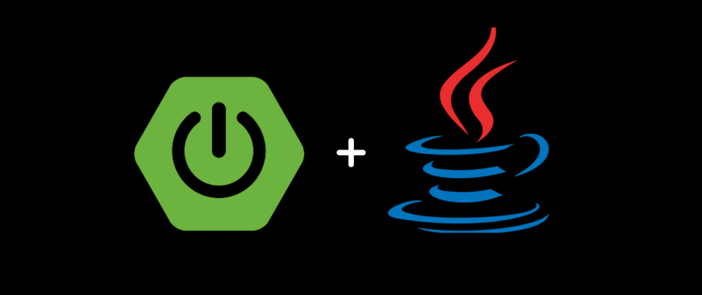

# Explore Java

<h3 align="center">Repositorio de Estudos e Conhecimentos de Java e Spring Bot</h3>

---

### Conteudos

Na Tabela abaixo está listado as dificuldades e categorias dos Projetos existentes neste Repositorio. Após acessar
alguma categoria, será exibido um menu para facilitar a navegação e busca dos topicos existentes

| [Conteudo Iniciante](A_BEGINNER/README.md)                          | [Conteudo Intermediario](B_INTERMEDIARY/README.md)                          | [Conteudo Avançado](C_ADVANCED/README.md)                          |
|---------------------------------------------------------------------|-----------------------------------------------------------------------------|--------------------------------------------------------------------|
| [Conteudo Iniciante: Java](A_BEGINNER/java/README.md)               | [Conteudo Intermediario: Java](B_INTERMEDIARY/java/README.md)               |                                                                    |
| [Conteudo Iniciante: Spring Boot](A_BEGINNER/spring_boot/README.md) | [Conteudo Intermediario: Spring Boot](B_INTERMEDIARY/spring_boot/README.md) | [Conteudo Avançado: Spring Boot](C_ADVANCED/spring_boot/README.md) |                                                                             |
| [Conteudo Iniciante: NoSQL](A_BEGINNER/no_sql/README.md)            | [Conteudo Intermediario: NoSQL](B_INTERMEDIARY/no_sql/README.md)            |                                                                    |

---

### Como Executar

#### Importando Projetos IntelliJ

- Abra o Diretorio na IntelliJ
- No Menu Superior clique em: `File` --> `New` --> `Module from Existing Sources`
- Selecione o arquivo `pom.xml` e clique em `Ok`
